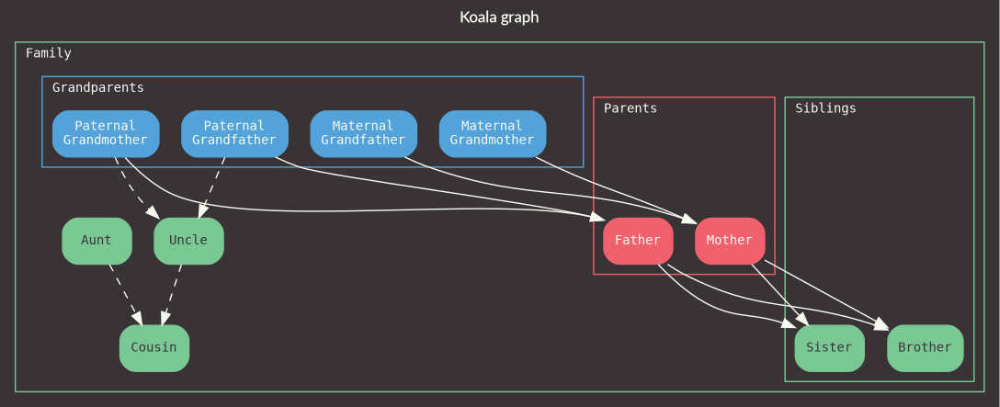

# Koala

A thread-safe, header-only C++17 library for managing object lifetimes and relationships.

If serialization is enabled, Koala depends on the cereal library v1.2.2 (https://github.com/USCiLab/cereal). For hierarchy visualization, the  dot application is required. On Ubuntu 18.04, this can be installed via `apt install graphviz`.

## Building
Installing the headers and a `koala-config.cmake` file can be done using cmake, e.g.:
```Shell
cd Koala
mkdir build
cmake .. -DCMAKE_INSTALL_PREFIX=/path/to/prefix
make install
```

If building with cereal support, the file `cmake/FindCereal.cmake` will be used to locate it:
```Shell
cd Koala
mkdir build
cmake .. -DCMAKE_INSTALL_PREFIX=/path/to/prefix -DTARGET_CEREAL_SUPPORT=ON
make install
```

The `libunwind-dev` package is required for building tests, e.g. on Ubuntu 18.04:
```Shell
apt install libunwind-dev
cd Koala
mkdir build
cmake .. -DCMAKE_INSTALL_PREFIX=/path/to/prefix -DBUILD_TESTS=ON
make install
```

## Example code
To reproduce the family tree graph at the top of this document, the following code can be run from within the test algorithm:
```C++
// Define members.
auto &brother = KL_CREATE_BY_ALIAS(TestObject, "Brother");
auto &sister = KL_CREATE_BY_ALIAS(TestObject, "Sister");
auto &mother = KL_CREATE_BY_ALIAS(TestObject, "Mother");
auto &father = KL_CREATE_BY_ALIAS(TestObject, "Father");

auto &maternalGrandfather = KL_CREATE_BY_ALIAS(TestObject, "Maternal\nGrandfather");
auto &maternalGrandmother = KL_CREATE_BY_ALIAS(TestObject, "Maternal\nGrandmother");
auto &paternalGrandfather = KL_CREATE_BY_ALIAS(TestObject, "Paternal\nGrandfather");
auto &paternalGrandmother = KL_CREATE_BY_ALIAS(TestObject, "Paternal\nGrandmother");

auto &uncle = KL_CREATE_BY_ALIAS(TestObject, "Uncle");
auto &aunt = KL_CREATE_BY_ALIAS(TestObject, "Aunt");
auto &cousin = KL_CREATE_BY_ALIAS(TestObject, "Cousin");

// Add daughter links.
mother.AddDaughterEdge(brother);
father.AddDaughterEdge(brother);
mother.AddDaughterEdge(sister);
father.AddDaughterEdge(sister);

paternalGrandfather.AddDaughterEdge(father);
paternalGrandmother.AddDaughterEdge(father);
paternalGrandfather.AddDaughterEdge<TestEdge>(uncle);
paternalGrandmother.AddDaughterEdge<TestEdge>(uncle);
maternalGrandfather.AddDaughterEdge(mother);
maternalGrandmother.AddDaughterEdge(mother);

uncle.AddDaughterEdge<TestEdge>(cousin);
aunt.AddDaughterEdge<TestEdge>(cousin);

// Add containers.
auto &family = KL_CREATE_BY_ALIAS(TestObject, "Family");
family.SubsumeSet(TestObject::UnorderedRefSet{
    mother, father, brother, sister, maternalGrandfather, maternalGrandmother,
    paternalGrandfather, paternalGrandmother, uncle, aunt, cousin});

auto &grandparents = KL_CREATE_BY_ALIAS(TestObject, "Grandparents");
grandparents.SubsumeSet(TestObject::UnorderedRefSet{maternalGrandfather, maternalGrandmother,
                                                    paternalGrandfather, paternalGrandmother});

auto &parents = KL_CREATE_BY_ALIAS(TestObject, "Parents");
parents.SubsumeSet(TestObject::UnorderedRefSet{mother, father});

auto &siblings = KL_CREATE_BY_ALIAS(TestObject, "Siblings");
siblings.SubsumeSet(TestObject::UnorderedRefSet{brother, sister});

// Visualize.
HierarchicalVisualizationOptions options;
options.m_displayPseudoEdges = false;
options.m_graphTitle = "Koala graph";
options.m_saveSvgToFile = true;
options.m_svgFilePath = "test.svg";
HierarchicalVisualizationUtility<TestObject>::Visualize(this->GetKoala(), family, options);
```

## License
(c) 2018 Jack Anthony

This source code is subject to the terms and conditions defined in the file LICENSE.
